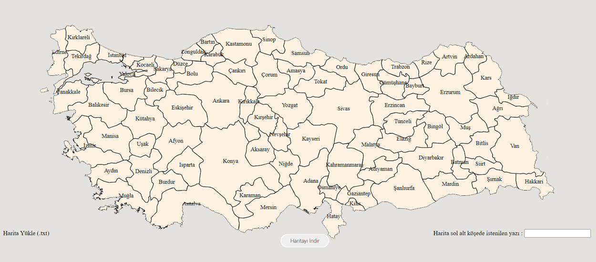

# TurkeyVisited

Haritayı indir dediğimiz zaman, işaretli haritaları cities.txt dosyası olarak kaydeder, daha sonra haritayı yükle diyerek eski haritanızı yükleyebilirsiniz.
Ziyaret edilen il sayısı sağ tarafta otomatik olarak indirdiğiniz haritaya yazılacaktır..

Türkiye'de ziyaret ettiğiniz illeri haritadan işaretleyin ve paylaşın!

demo : https://try.myasustor.com/turkey/

Orjinal Kodlar : https://github.com/ozanyerli/turkeyvisited

